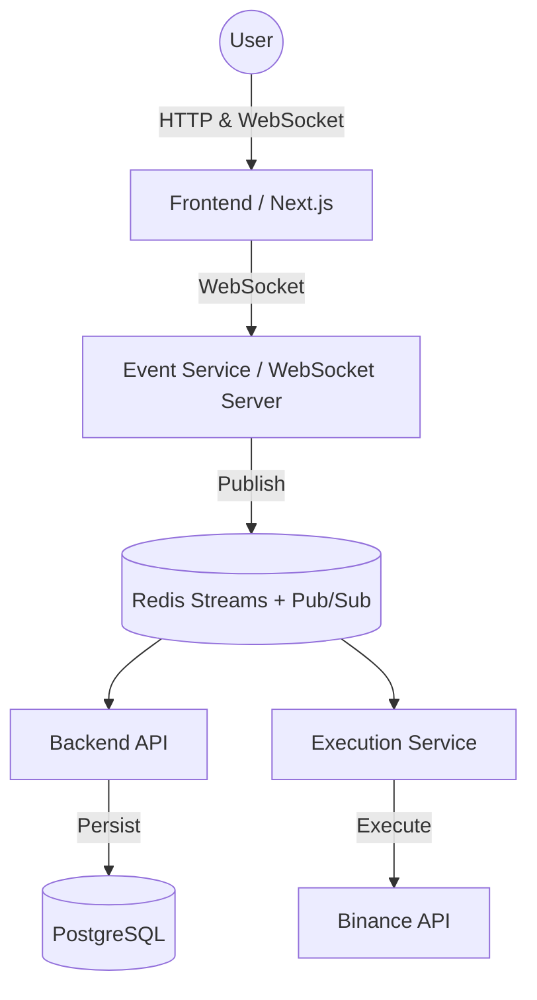

# TradeCO  
**A Full-Stack, Event-Driven Trading Platform**

## Local Development

Use the local setup guide for the Postgres/Redis Docker Compose stack, service `.env` files, and startup commands:

[docs/local-setup.md](docs/local-setup.md)

For a full app stack with frontend, backend, event service, execution service, Postgres, and Redis:

```sh
cp .env.deploy.example .env.deploy
npm run deploy:compose:up
```

See [docs/deployment.md](docs/deployment.md) for Docker Compose, nginx reverse proxy, and PM2 deployment guidance.

TradeCO is a production-inspired trading platform built to demonstrate advanced system design, backend architecture, real-time event processing, and frontend engineering.

Instead of a CRUD-style application, TradeCO models how modern trading systems are actually structured: decoupled services, asynchronous workflows, streaming data, and failure-isolated components.

This project was built as an engineering assignment to showcase architecture, not just features.

---

## Live Demo

- **Application:** https://tradeco.devpushkar.com  
- **Video Walkthrough:** https://youtu.be/zWeUJQZotOI

---

## Problem Statement

The goal was to design and implement a system capable of handling real trading-like complexity:

- Secure authentication and user state
- Asynchronous order execution
- Real-time market data and order updates
- High-performance charting
- Scalability beyond a monolith

---

## System Overview

Numatix is structured as a **monorepo** containing multiple decoupled services:

- **Frontend:** Next.js (App Router)
- **Backend API:** Node.js + PostgreSQL
- **Event Service:** Redis Pub/Sub + WebSockets
- **Execution Service:** Node.js + Binance API

Each service has a clearly defined responsibility and communicates through events rather than tight coupling.

## Operations Runbooks

Initial operations runbooks live in [docs/runbooks](docs/runbooks/README.md). They cover testnet credential safety, key rotation, testnet reset handling, local setup verification, service recovery, command processing, and rollback structure.

---

## Architectural Philosophy

- **Event-Driven Design**  
  Services react to events instead of synchronous request chains.

- **Separation of Concerns**  
  Execution, persistence, and real-time delivery are isolated.

- **Stateless Services**  
  Horizontal scalability is supported by design.

- **Failure Isolation**  
  External API failures do not cascade into user-facing downtime.

---

## High-Level Architecture



⸻

Service Breakdown

1. Frontend

Path: apps/frontend
Stack: Next.js (App Router), TailwindCSS, Lightweight Charts, Zod

Responsibilities:
	•	UI rendering and authentication flow
	•	Real-time candlestick charting
	•	Subscribing to live market and order streams
	•	Merging historical snapshots with streaming updates

Key Detail:
The frontend receives ORDER_UPDATE and KLINE_UPDATE events via WebSockets. No polling is used.

⸻

2. Backend API

Path: apps/backend
Stack: Node.js, Prisma, PostgreSQL, Redis

Responsibilities:
	•	Authentication and authorization
	•	Persistence layer (source of truth)
	•	Order and position state management

Design Decision:
This service never executes trades. It validates requests, stores state, and acts as a secure gateway.

⸻

3. Event Service

Path: apps/event-service
Stack: Node.js, Redis, WebSocket Server

Responsibilities:
	•	Central real-time communication hub
	•	Subscribes to Redis channels
	•	Broadcasts events to connected frontend clients

⸻

4. Execution Service

Path: apps/execution-service
Stack: Node.js, Binance API

Responsibilities:
	•	External exchange integration
	•	Trade execution logic

Execution Flow:
	1.	Consumes ORDER_COMMAND from Redis Streams. Legacy Pub/Sub order consumption is fallback-only during the transition.
	2.	Executes trade on Binance
	3.	Publishes ORDER_EVENT back to Redis

⸻

Data Flow Walkthroughs

Authentication Flow
	1.	User logs in from the frontend
	2.	Backend validates credentials
	3.	JWT/session token is issued
	4.	Token is attached to HTTP and WebSocket connections

⸻

Order Lifecycle (Asynchronous)
	1.	User places an order from the UI
	2.	Frontend sends the order to the authenticated Backend API
	3.	Backend validates the JWT, derives user identity from the token, persists the command, and publishes/appends ORDER_COMMAND to Redis
	4.	Execution Service consumes and executes on Binance Testnet
	5.	Binance confirms execution
	6.	Execution Service persists/fans out ORDER_EVENT updates
	7.	Event Service pushes scoped updates only to the authenticated user

Core backend lifecycle endpoints:

- `POST /orders` places an order asynchronously.
- `GET /orders/:orderId` queries one authenticated user's local order lifecycle.
- `GET /orders/open?symbol=BTCUSDT` lists local open orders, optionally scoped to a symbol.
- `DELETE /orders/:orderId` cancels one open order asynchronously.
- `DELETE /orders/open?symbol=BTCUSDT` cancels all open orders for a symbol asynchronously.

Redis Streams contract:

- Stream names and message fields are defined in [docs/architecture/redis-stream-contracts.md](docs/architecture/redis-stream-contracts.md).
- The shared implementation lives in `packages/redis-stream-contracts`.
- Backend `POST /orders` persists `OrderCommand`, appends `order.submit.requested.v1` to `ORDER_COMMAND_STREAM`, and temporarily publishes `COMMANDS_CHANNEL`; cancel endpoints append `order.cancel.requested.v1` and `order.cancel_all.requested.v1` stream-only commands. Execution consumes the stream by default.

⸻

Deployment & Infrastructure
	•	One-command Docker Compose stack is available in `docker-compose.deploy.yml`
	•	Nginx reverse proxy sample lives in `deploy/nginx/tradeco.conf`
	•	PM2 process config for non-Docker deployments lives in `ecosystem.config.cjs`
	•	External Exchange: Binance Spot Testnet API

⸻

Database Design

ORM: Prisma
Database: PostgreSQL

Table	Description
User	Authentication and profile data
OrderCommand	Intent to buy or sell
OrderEvent	Execution result (Filled, Rejected, etc.)
Position	Aggregated holdings per trading symbol


⸻

Engineering Notes

Account/Balance Event Contract

The canonical account balance Redis/WebSocket channel is `events:account:balances`.

Execution Service publishes balance events with this payload shape:

```json
{
  "type": "ACCOUNT_BALANCES",
  "userId": "authenticated-user-id",
  "ts": 1710000000000,
  "balances": [{ "asset": "USDT", "free": "1000.00", "locked": "0" }]
}
```

Frontend clients must not send `userId` for account or order authority. Account snapshots are requested through `GET /account-info` on the Event Service with a Bearer token; the Event Service verifies the token and forwards the authenticated user scope internally. Realtime balance updates arrive through `events:account:balances`; `events:account:update` is not part of the contract.

⸻

Key Engineering Decisions
	•	Redis over HTTP for Inter-Service Communication
Enables loose coupling and independent service failure.
	•	Isolated Execution Layer
External exchange instability cannot impact core services.
	•	Trade-offs & Limitations
	•	Simplified risk engine
	•	JWT-based authentication
	•	No automated exchange failover

⸻

Author

Pushkar Dev
Full-Stack Engineer
	•	Portfolio: https://devpushkar.com
	•	Live App: https://tradeco.devpushkar.com
